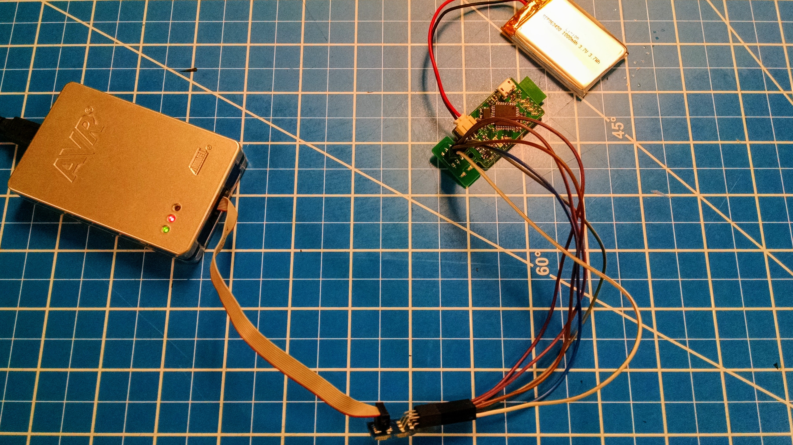

# Programming Arduino Firmware on an Atmega32U4

This page is not really specific to this project and should be useful to anyone trying to program Arduino firmware onto an [Atmega32U4](http://www.atmel.com/Images/Atmel-7766-8-bit-AVR-ATmega16U4-32U4_Datasheet.pdf) chip.

## What you'll need

You will need:

* An ICSP programmer (such as the [JTAGICE3](http://www.atmel.com/tools/jtagice3.aspx))
* The [avrdude](http://www.nongnu.org/avrdude/) software
* Firmware for the chip. We used SparkFun's [Caterina](https://cdn.sparkfun.com/datasheets/Dev/Arduino/Boards/32U4Note.pdf) bootloader (Caterina-promicro8.bin from [here](https://github.com/sparkfun/Arduino_Boards/tree/master/sparkfun/avr/bootloaders/caterina))
* A board with an Atmega32U4 and an ICSP header, such as our [Tag Board](../hardware/#the-tag)

### Tip for Linux users

You may need to setup port permission for your programmer. For the JTAGICE3, you'll need to create a `/etc/udev/rules.d/98-local-jtagice3.rules` file with the following line:

```
SUBSYSTEM=="usb", ATTRS{idVendor}=="03eb", ATTRS{idProduct}=="2140", GROUP="dialout"
```

Also, be sure your user is in the `dialout` group.

## Instructions



### Step 1: Hook up your programmer

Connect your programmer to the ICSP header on your board. Double check the pinouts and orientations (many ICSP connectors are not keyed) before powering things up.

Remember that your programmer generally does not supply power to the board, so you'll need to supply that yourself.

### Step 2: Test the connection

The following command will read the three sets of fuse bits from the microcontroller and write the values to three text files on your system:

```
avrdude -v -pm32u4 -cjtag3isp -Pusb -B22 -U efuse:r:efuse.hex:h -U hfuse:r:hfuse.hex:h -U lfuse:r:lfuse.hex:h
```

You should get some output that ends with:

```
avrdude: safemode: hfuse reads as 99
avrdude: safemode: efuse reads as F3
avrdude: safemode: Fuses OK (E:F3, H:99, L:5E)

avrdude done.  Thank you.
```

### Step 3: Programming

With the firmware file placed in your working directory, run the following command to set the fuse bits and program your chip:

```
avrdude -v -pm32u4 -cjtag3isp -Pusb -B22 -U flash:w:Caterina-promicro8.hex -U hfuse:w:0xd8:m -U lfuse:w:0xff:m -U efuse:w:0xfe:m
```

It may fail to write the efuse. If prompted, answer 'y' to retry. If it fails, don't worry.

### Step 4: Try it!

Plug your board into your computer over USB and program it with the Arduino software.

## Notes and References

The above commands assume you're using a JTAGICE3 programmer to program an Atmega32U4 clocekd at 8 MHz with a 3.3V supply voltage. If any of those things are not quite the same for you, you'll have to adjust things a bit.

You can find fuse bit settings that go along with the various SparkFun firmwares on [their repository](https://github.com/sparkfun/Arduino_Boards/blob/master/sparkfun/avr/bootloaders/caterina/program.txt).

### Useful References

* [Fuse bit calculator](http://www.engbedded.com/fusecalc/)
* [JTAGICE3 Pinout](http://www.atmel.com/webdoc/jtagice3/jtagice3.using_ocd_physical_spi.html#jtagice3.spi_header_pinout)
* [AVRDUDE Refernce](http://www.nongnu.org/avrdude/user-manual/avrdude_4.html)
* A [blog post](http://electronut.in/bootloader-atmega32u4/) from someone else who has done this
