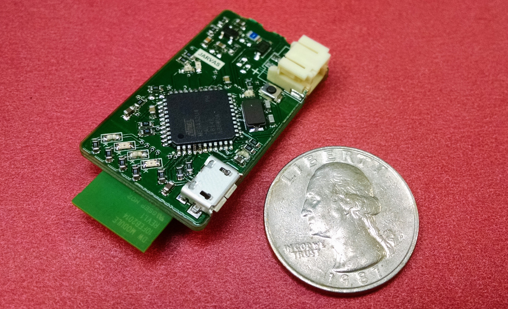
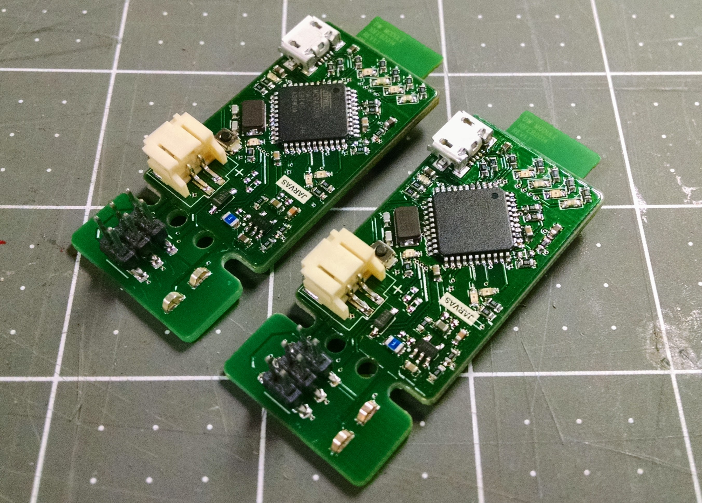
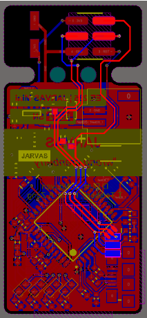
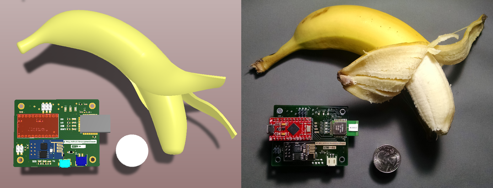

# JARVAS Hardware

The core of the JARVAS system is the DWM1000 (
[product page](http://www.decawave.com/products/dwm1000-module),
[datasheet](http://www.decawave.com/sites/default/files/resources/dwm1000-datasheet-v1.3.pdf)
) radio module, an ultra wideband transciever module optimized for time of
flight ranging systems, and the Atmega32U4 processor.

There are two versions of the JARVAS hardware: a base station board that
supports WiFi (using an
[ESP8266](https://nurdspace.nl/images/e/e0/ESP8266_Specifications_English.pdf)
) and is designed for easy debugging, and a small, low-cost tag module.
The system requires at least one of the anchors have WiFi support so transmit
location data to a server, however all other anchors and tags in the system
may use either the larger base station board or the small tag board.

## The Tag

The tag board hosts an Atmega32U4, a single-cell LiPo/Li-Ion connector, a few
debugging LEDs, and the DWM1000 radio module. It is essentially a
purpose-built version of the popular [SparkFun Pro Micro](https://www.sparkfun.com/products/12587)
or the [Adafruit Atmega32U4 breakout](https://www.adafruit.com/product/296)
with a DWM1000 module built in.

In total, it measures 1.5"x0.9" without the programming tag.

Note that while we call this this "tag", it is completely capable of being
used as an anchor as well, provided that there is at least one anchor in the
system which supports WiFi.

### Programming Header

The tag comes with a break-away section for initial programming. The
section at the top contains test points for the 3.3 V and GND rails and an
ICSP header. This ICSP header can be used to program the Atmega32U4. If you
choose to install the Arduino firmware, as described [here](firmware),
you can program this board directly over USB through the Arduino software.
Once you verify that everythings is working, this top section can be broken
off to reduce the size and height of the PCB.

## The Anchor

The anchor is the larger, more debug-friendly, and WiFi-supporting version.
It is extremely similar to the tag except for the addition of an ESP8266 WiFi
Module and using an off-the-shelf Arduino Pro Micro instead of having an
Atmega32U4 on-board. This means that no programmer is required to get this
board up and running. The downside, though, is that it is significantly larger
and costs more.
