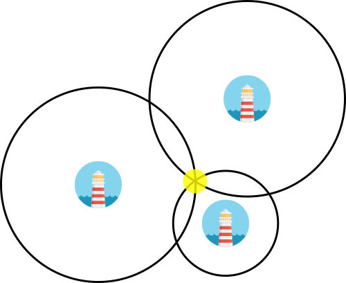
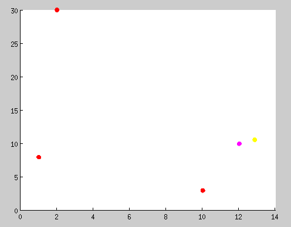

# Localization

JARVAS estimates your position using a linear least squares algorithm based
on time of flight ranging data. On this page, we will break down how this
works in detail.

Imagine you are on a ship and can see a single lighthouse in the distance. 
Let's say you can tell the distance to this lighthouse but nothing else.
If you were looking at a map and knew the location of the lighthouse, you
could draw a circle around the lighthouse and know that you were somewhere
along the circle.

Now let's say you can see a second lighthouse and also your know distance to 
it (but not, let's pretend, the angle between the two lighthouses). Now you
have two circles you can draw. Assuming the two lighthouses are in different
locations, the circles will overlap in one or two locations. Finally, by
adding a third lighthouse, you can figure out which point you are at.

Derived from image by pixelbuddha [CC BY 3.0 (http://creativecommons.org/licenses/by/3.0)], via Wikimedia Commons

## Linear Least Squares Estimation

If you aren't familiar with linear least squares estimation, we recommend some
background reading before jumping into this:

[Wikipedia: Linear Least Squares](https://en.wikipedia.org/wiki/Linear_least_squares_(mathematics))

[Stanford Linear Algebra Course Notes](http://ee263.stanford.edu/lectures/ls.pdf)

Our linearized technique is based on the first method described in 
"Linear least squares localization in sensor networks" by Yue Wang (DOI: 
[10.1186/s13638-015-0298-1](http://link.springer.com/article/10.1186/s13638-015-0298-1)).

In general, localization based on a set of distances in a non-linear problem,
however there are linear approximtaions that work quite well.

Each anchor has some known position \((x_i,y_i\) and is can measure a distance
\(\hat{d_i}\) to the tag. For a single anchor \(i\) ranging to a tag at
position \((x,y)\), this
gives us the simple geometric equation:

$$ (x-x_i)^2+(y-y_i)^2=d_i^2 $$

We can then re-arrange this expression as follows:

$$ x^2-2xx_i+x_i^2+y^2-2yy_i+y_i^2=\hat{d}_i^2 \\
-2xx_i - 2yy_i + (x^2+y^2) = \hat{d}_i^2 - x_i^2 - y_i^2 $$

We have three (or more) anchors, so we can write at least three of these
equations. Written in matrix form, we have:

$$
\begin{bmatrix}
-2x_1 & -2y_1 & 1 \\
-2x_2 & -2y_2 & 1 \\
-2x_3 & -2y_3 & 1
\end{bmatrix}
\begin{bmatrix}
x \\
y \\
x^2 + y^2
\end{bmatrix}
=
\begin{bmatrix}
\hat{d}_1^2-x_1^2-y_1^2 \\
\hat{d}_2^2-x_2^2-y_2^2 \\
\hat{d}_3^2-x_3^2-y_3^2
\end{bmatrix}
$$

This gives us the standard form:

$$
\begin{bmatrix}
x \\
y \\
x^2 + y^2
\end{bmatrix}_{ls}
=
\begin{bmatrix}
-2x_1 & -2y_1 & 1 \\
-2x_2 & -2y_2 & 1 \\
-2x_3 & -2y_3 & 1
\end{bmatrix}^\dagger
\begin{bmatrix}
\hat{d}_1^2-x_1^2-y_1^2 \\
\hat{d}_2^2-x_2^2-y_2^2 \\
\hat{d}_3^2-x_3^2-y_3^2
\end{bmatrix}
$$

The left side of the equation is what we want to solve for. Specifically, we are interested in the first two terms of the vector: \(x\) and \(y\).

On the right, the large matrix that we have to take the 
[pseudo-inverse](https://en.wikipedia.org/wiki/Moore%E2%80%93Penrose_pseudoinverse)
of is a function only of the configuration of the system. It changes only if the anchors move, not if the tag moves. This is very important because taking the pseudo-inverse requires a non-trivial number of computations, especially as you start adding more anchors.

At runtime, this works out to be a single matrix-vector multiplication of a 3x3 by a 3x1.

## MATLAB Implementation

In order to test this algorith, we created a MATLAB script that takes in a set of positions and ranges and outputs a graph of the real and estimated location of the tag. If you are intersted in extending this project to use any of several possible better linearized algorithms, this MATLAB script would be a good starting point.

You can find the two MATLAB files `rangepositioning.m` and `plotposition.m` in the [simulation folder](https://github.com/dddutz/jarvas-indoor-positioning-system/tree/master/simulation) of our repository.

## C Implementation

In the JARVAS system, this processing is run on the tag iself. The C implementaiton of this algorithm uses the Arduino MatrixMath library and lives in the [tag sketch](https://github.com/dddutz/jarvas-indoor-positioning-system/blob/master/tag/tag.ino).

